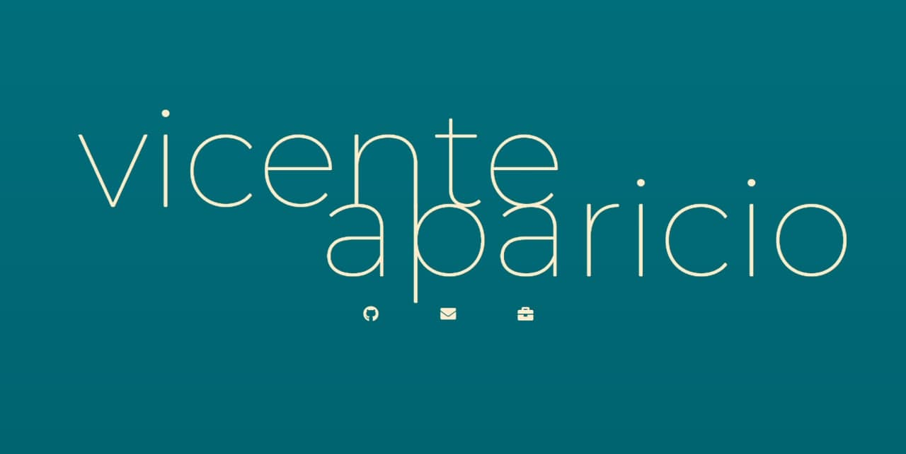
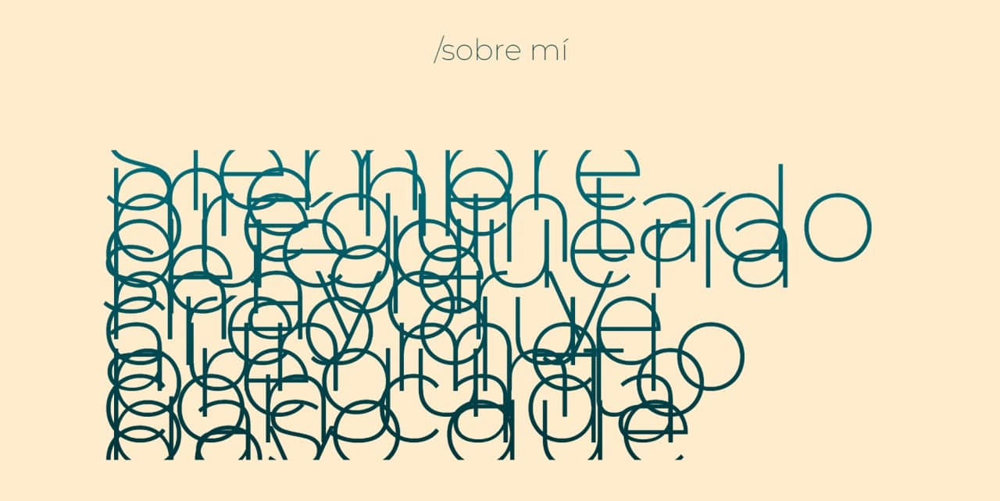

## First Static Personal Page

- Start date: 3 May 2021
- Delivery date: 9 May 2021
- Dedicated time: <25 hours 

En este proyecto he realizado una versión primitiva y estática de lo que podría ser mi futura web personal como desarrollador.

https://vicenteaparicio.github.io/FSD_StaticPersonalPage/

***

### Una vez abierta la página debería quedar así:

>Si quieres hacerte conocer, pon tu nombre bien grande en algún lado. 

***

## Tecnologías usadas

- HTML5
- CSS3
- JAVASCRIPT

Aunque este proyecto usaba las mismas tecnologías que el anterior, se me ha hecho mucho más difícil debido a la necesidad de ser creativo. La creatividad, como todo en esta vida, tiene que trabajarse. 

***

## Interactividad

>Si se lo das todo hecho, nunca tendrá que buscarlo.

He buscado la manera de crear la necesidad de interactuar con mi web. De esta manera el espectador se convierte en actor de la experiencia que he querido implantar, al menos de forma sutil, en esta primera y vintage versión de mi web personal. 

***

## Lo que me ha quedado por hacer
Mucho, mucho me ha quedado por hacer. Desde desarrollar un buen carrusel de los proyectos de diseño gráfico donde mostrar en secciones que se van desplegando las explicaciones de cada uno de ellos hasta añadir efectos de paralax para crear profundidad en la web. 

***

## ¿En qué debo mejorar?
En todo. Mi código sigue ensuciándose rápidamente con elementos innecesarios. A veces por querer abarcar más de lo que mis conocimientos son capaces de realizar. Me desvío muchas veces en problemas pequeños que me quitan mucho tiempo y dejo de lado partes más importantes que necesitan una buena mano de chapa y pintura. 
